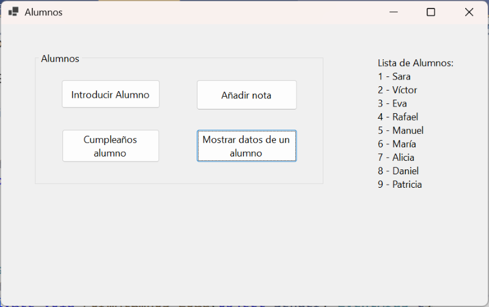
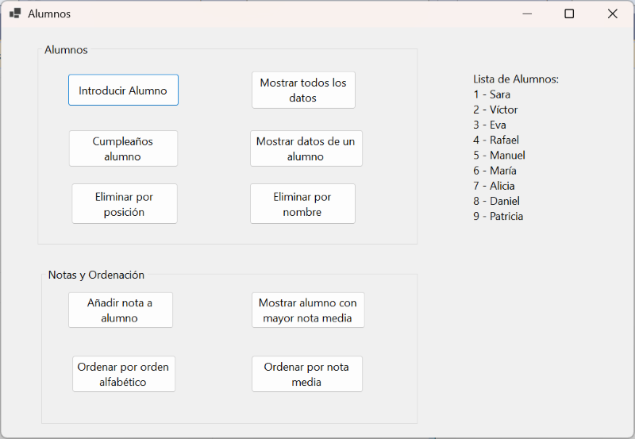
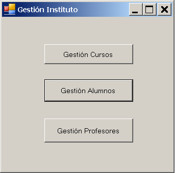
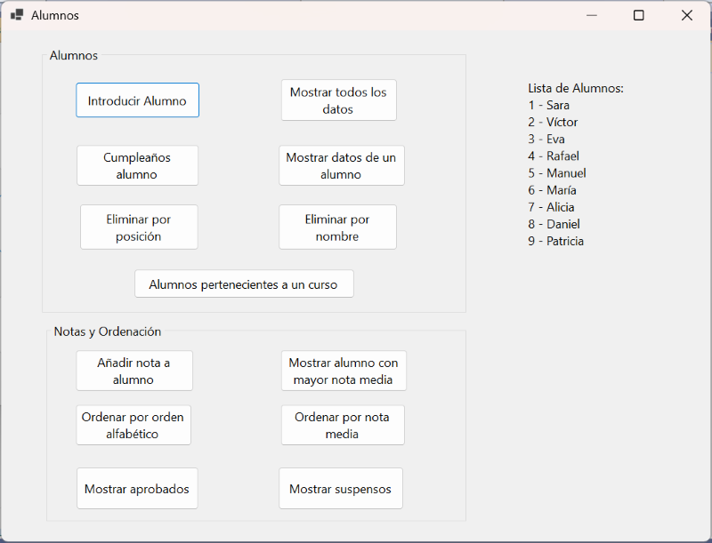
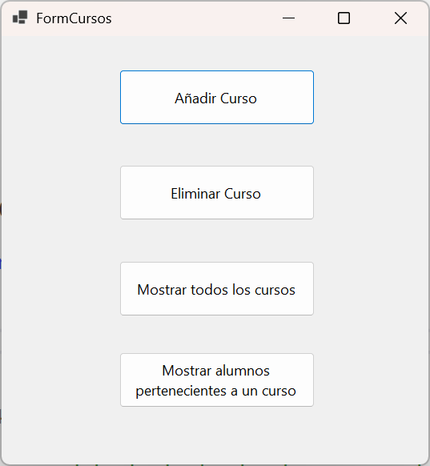

                                     

<br>

# Instrucciones generales

- **Entorno:** Visual Studio 2022 (Community). Proyectos **Windows Forms y Consola** en C#.
- **Alcance del Tema 7:** Introducción a la POO: clases, objetos, listas de objetos.
- **Estilo de código (Microsoft):**
  - Variables y parámetros: *camelCase* (p. ej., precioNeto).
  - Constantes/propiedades: *PascalCase* (p. ej., Iva, TipoCambio).
  - Controles en Forms: `txtNombre`, `lblResultado`, `btnCalcular`, etc.
  - Funciones: *PascalCase* (p. ej. `CalcularPrecioTotal()`);
	POO:
  - Nombres de clases: *PascalCase* (p.ej. Clase `Profesor`). Uso de sustantivos.
  - Nombres de campos: *camelCase* anteponiendo un guión bajo (p.ej. `_nombreProfesor`) Uso de sustantivos o adjetivos.
  - Nombres de métodos: *PascalCase* (p.ej.  `CalcularDescuento`) Uso de verbos.
  - Nombres de propiedades: *PascalCase* (p.ej. `Edad`) Mismo nombre del campo que encapsula.

- Buenas prácticas exigidas:
  - Evita duplicar código: modulariza lectura, impresión, cálculo y validación cuando tenga sentido
  - Valida entradas (TryParse) cuando se pida lectura segura.
  - Salidas con **cadenas interpoladas y formato** (C2, P1, N0, …) cuando aplique.


<br>

## Ejercicio 1. Trabajar con una lista de personas (Windows Forms)

Realizar un programa que tendrá una clase `Persona` que tendrá los datos nombre, edad, teléfono, sexo y si está casado. Esta clase se implementó en los ejercicios del tema 5.

También implementaremos el código necesario para trabajar con una **lista de personas**, a la manera como se implementa en el apartado 3 del tema 7.

Realizar un botón para leer los datos de una persona y otro para imprimir los datos de todas las personas.

<br>

## Ejercicio 2. Lista de Fechas (Consola)

Ampliando el ejercicio 2 del tema 5, escribir un programa que construya una **lista de fechas** (la fecha será una clase con tres campos: día, mes, año).

Utilizaremos la clase `Fecha` que implementamos en ese ejercicio.

Tendremos en nuestro programa principal una lista de fechas y un menú con las siguientes opciones:

- Opción *leer*, que lee una fecha añadiéndola a la lista, siempre y cuando la fecha sea correcta.
  
- Opción *ordenar* que clasifica la lista anterior tomando como campo más importante el año, luego el mes y finalmente el día.
  
- Opción listar, que imprime la lista de fechas.

<br>

## Ejercicio 3. Clase Lista de Alumnos (Consola)

Realizar el ejercicio planteado en el **apartado 4 del tema 7** en el que tenemos una clase `Alumnos` y otra clase `ListaAlumnos` en la que implementamos los métodos para trabajar con esa lista.

Implementar la clase estática `FuncionesInterfaz` y el programa principal con las distintas opciones en un menú.

<br>

## Ejercicio 4. Clase Lista de Alumnos (Windows Forms)

Aprovechando las clases `Alumno` y `ListaAlumnos` que implementamos en el ejercicio anterior, vamos a empezar a implementar su utilización en una interfaz con Windows Forms.

Realizar un programa que, de momento, tenga la siguiente interfaz:



- En el evento `Load` del formulario se cargarán en la lista los alumnos de ejemplo. 
  
- El botón **Introducir Alumno** añadirá un alumno a la lista pidiendo su nombre y su edad.
- 
- El botón de **Cumpleaños alumno** pedirá el nombre del alumno y le sumará un año llamando al método cumpleAnyos del objeto.
  
- **Añadir nota** pedirá el nombre del alumno y la nota a introducir.
  
- Cada vez que modifiquemos la lista de alumnos mostraremos los nombres en el label de la derecha.

<br>

## Ejercicio 5. Clase Lista de Alumnos

Vamos a ampliar el ejercicio anterior para implementar las siguientes funcionalidades:



- **Mostrar todos los datos**, mostrará en un mensaje los datos de todos los alumnos
  
- **Eliminar por posición** pedirá la posición del alumno a eliminar
  
- **Eliminar por nombre** pedirá el nombre del alumno a eliminar.
  
- Ordenar por orden alfabético.
  
- Ordenar por nota media (si un alumno no tiene notas se considerará que su nota media es 0).
  
- Obtener el alumno con mayor nota media (sin ordenar antes).

<br>

## Ejercicio 6. Integrador. Centro Escolar

Queremos realizar un programa para gestionar un centro escolar.

Al **iniciar el programa** nos aparecerá una pantalla como la siguiente:



Este formulario inicial nos permitirá acceder a las distintas pantallas o formularios para gestionar los cursos, los alumnos y los profesores.

Tendremos que crear las **siguientes clases** en nuestro proyecto:

### CLASES:

A semejanza del ejercicio anterior tendremos las clases `Curso`, `ListaCursos`, `Alumno`, `ListaAlumnos`, `Profesor`, `ListaProfesores`.

**Los cursos** tendrán los siguientes datos: 

- nombre y código.
  
**Los alumnos**: 

- nombre, dni, edad, lista de notas y código del curso al cuál pertenecen (puede ser -1 si no pertenecen a ningún curso). 
  
**Los profesores**: 

- nombre, dni, lista de nombres de las asignaturas que imparten y código del curso del cual son tutores (si lo son, -1 en otro caso).

### Llamadas entre formularios

En este ejercicio tendremos que **llamar a otros formularios** desde el formulario inicial. 

Además, los objetos lista de alumnos, el de la lista de profesores y el objeto de la lista de cursos **se crearán en el formulario inicial** y por tanto **tendremos que pasarlos al formulario correspondiente** donde queramos manejarlos (cursos, alumnos, profesores). 

Estos objetos tendrán el **`new` en el formulario inicial** y después en los distintos formularios tendremos **instancias** del mismo.

**Vamos a ver cómo hacer esto con la lista de alumnos.**

En primer lugar, las clases `ListaAlumnos` y `Alumno` las vamos a hacer públicas. Poner `public` delante de la definición de clase: 

```csharp
public class ListaCursos 
{
  ...
}
```
y

```csharp
public class Alumno
{
  ...
}
```

En el **formulario de alumnos** definiremos un objeto de tipo **`ListaAlumnos` pero no haremos `new`** ya que recogeremos la lista de alumnos que se creará en el formulario inicial. 

Además, cambiaremos el **constructor del formulario** para que tenga un parámetro a través del cual le pasaremos la lista de cursos creada en el formulario inicial:

```csharp
    public partial class FormAlumnos : Form
    {
        ListaAlumnos listaAlumnos;

        public FormAlumnos(ListaAlumnos listaAlumnos)
        {
            InitializeComponent();
            this.listaAlumnos = listaAlumnos;
        }
	…
```

Vamos a ver la **forma de llamar a un formulario desde otro**. En concreto llamar al formulario de alumnos desde el formulario inicial.

Habremos añadido los formularios inicial y alumnos a nuestro proyecto. 

Desde el botón de Gestión de Alumnos del formulario inicial llamaremos al formulario de alumnos.

Además, **le pasamos al formulario la lista de alumnos en el constructor** para que pueda manejarla:

```csharp
public partial class FormInicial : Form
{
    // Creamos la lista de alumnos.
    ListaAlumnos listaAlumnos = new ListaAlumnos();
    // Crear aquí también la lista de profesores y de cursos.

    public FormInicial()
    {
        InitializeComponent();
    }

    private void FormInicial_Load(object sender, EventArgs e)
    {
        FuncionesInterfaz.RellenarConDatosEjemplo(listaAlumnos);
    }

    private void btnAlumnos_Click(object sender, EventArgs e)
    {
        // Creamos el formulario pasándole la lista de alumnos creada en este...
        FormAlumnos formAlumnos = new FormAlumnos(listaAlumnos);

        // Aquí mostramos el formulario, que ya tendrá la lista de alumnos.
        formAlumnos.ShowDialog();
    }
}
```
<br>

De esta forma en cada botón de la pantalla inicial llamaremos a los formularios de cursos, alumnos y profesores.

<br>

### FORMULARIO DE ALUMNOS:

Al entrar en la gestión de alumnos aparecerá una pantalla similar a la siguiente, que ya hemos trabajado en el ejercicio anterior, aunque hemos añadido alguna funcionalidad adicional:



<br>

### FORMULARIO DE CURSOS

Cuando se pulse el botón de cursos aparecerá una pantalla similar a la siguiente:



- **Añadir curso** nos permitirá introducir un nuevo curso (código y nombre).
  
- **Eliminar curso**, borrará un curso pidiendo su código.
  
- **Mostrar todos los alumnos**. Se introducirá un código de curso y se mostrará los datos de todos los alumnos pertenecientes a ese curso.
  
- **Mostrar alumnos pertenecientes a un curso**, pedirá el código del curso y mostrará aquellos alumnos que pertenezcan al mismo.

<br>

### FORMULARIO DE PROFESORES:

Al pulsar el botón de gestión de profesores aparecerá un formulario similar al siguiente:


